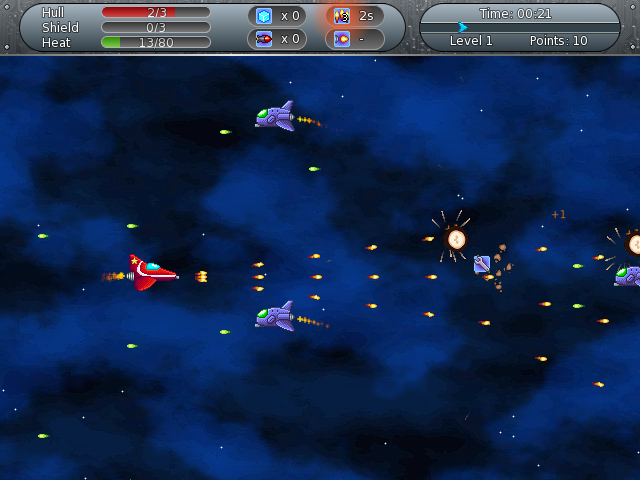

# CosmoScroll

CosmoScroll is a space-based shoot'em up game. Inspired by games such as R-Type and Gradius, it features side-scrolling, retro-looking graphics and chiptune music.

This project is written in C++ with the SFML library. It also uses DUMB for playing modules files, and TinyXML for parsing XML files.

- Author: Alexandre Bodelot <alexandre.bodelot@gmail.com>
- Website: https://github.com/abodelot/cosmoscroll
- License: GPL (see `LICENSE` file)

## How to play?

### Keyboard layout

- Move spaceship: <kbd>Up</kbd>, <kbd>Down</kbd>, <kbd>Left</kbd>, <kbd>Right</kbd>
- Fire: <kbd>Space</kbd>
- Launch missile: <kbd>A</kbd>
- Use ice cube power-up: <kbd>Left Ctrl</kbd>
- Pause the game: <kbd>Escap</kbd>
- Place HUD at the top of the screen: <kbd>Page Up</kbd>
- Place HUD at the bottom of the screen: <kbd>Page Down</kbd>
- Take a screenshot (saved in `screenshots` directory): <kbd>F1</kbd>

You can also play with a pad or a joystick. Keyboard and joystick layouts can be configured in the *Options* menu.

### Power-ups

Power-ups are randomly dropped when an enemy is destroyed.

- *Repair*: Restores 1 health point.
- *Full repair*: Restores all health points.
- *Shield*: Restores 1 shield point.
- *Full shield*: Restores all shield points.
- *Ice cube*: Gives +1 ice cube. Use an ice cube to instantly cool down the weapon system and cancel over-heat. You can store up to 5 ice cubes.
- *Missile*: Gives +1 missile. One shot can destroy many enemies. You can store up to 5 missiles.
- *Double laser*: Doubles laser for 10 seconds.
- *Triple laser*: Triples laser for 10 seconds.
- *Speed*: Increases speed for 10 seconds

## How to compile?

CosmoScroll should compile on any system supported by SFML (Windows, Linux, MacOS).

First, you must install the following libraries:

- [SFML](http://www.sfml-dev.org/), version >= 2.4
- [libdumb](http://dumb.sourceforge.net/) (for Debian/Ubuntu, simply install the `libdumb1-dev` package)

Run the `make` command if you are using a UNIX-based system with the `gcc` compiler, or you can use the Code::Blocks project file (`cosmoscroll.cbp`).

If you want to use another compiler than `gcc`:
- Make sure your compiler is c++11 compliant
- Add the `src` directory in your compiler search path
- Link against the aforementioned libraries

## Configuration file

CosmoScroll saves your configuration in your application settings directory, using your operating system's convention:

- Windows: `Application Data/cosmoscroll/cosmoscroll.ini`
- Linux:   `~/.config/cosmoscroll/cosmoscroll.ini`
- Mac OS:  `~/Library/Application Support/cosmoscroll/cosmoscroll.ini`

If you don't want CosmoScroll to store your configuration in this directory, you can set another location with the `-config` argument in command line.

You can reset the game by deleting this file, a new one will be created the next time the game is launched. Take note you will lost your entire configuration (scores, level  progression, settings, etc.) by deleting the settings file.

## Credits

### Sounds

- title.ogg: kindly made by [Mr. Megahertz](https://soundcloud.com/mrmegahertz)
- boom.ogg: [Chromium B.S.U.](http://www.reptilelabour.com/software/chromium/)
- cash-register.ogg: [atha89 on freesound.org](http://www.freesound.org/people/atha89/sounds/79063/)
- laser-green.ogg: [CGEffex on freesound.org](http://www.freesound.org/people/CGEffex/sounds/96692/)
- end-level.ogg: [metamorphmuses on freesound.org](http://www.freesound.org/people/metamorphmuses/sounds/38728/)

### Musics

- [back_in_1982.mod](http://modarchive.org/index.php?request=view_by_moduleid&query=66188)
- [ground_zero.mod](http://modarchive.org/index.php?request=view_by_moduleid&query=65883)
- [hungry.mod](http://modarchive.org/index.php?request=view_by_moduleid&query=159539)
- [spacesong.mod](http://modarchive.org/index.php?request=view_by_moduleid&query=65925)
- [6sievert.mod](http://modarchive.org/index.php?request=view_by_moduleid&query=162477)
- [tempested.mod](http://modarchive.org/index.php?request=view_by_moduleid&query=173057)
- [toxisystem.mod](http://modarchive.org/index.php?request=view_by_moduleid&query=172373)
- [virtual_journey.mod](http://modarchive.org/index.php?request=view_by_moduleid&query=132838)

### Fonts

- hemi-head.tff: [Typodermic Fonts Inc.](http://www.dafont.com/hemi-head.font)
- Vera.ttf: [Gnome Project](http://www.dafont.com/bitstream-vera-sans.font)
- VeraMono.ttf: [Gnome Project](http://www.dafont.com/bitstream-vera-mono.font)
